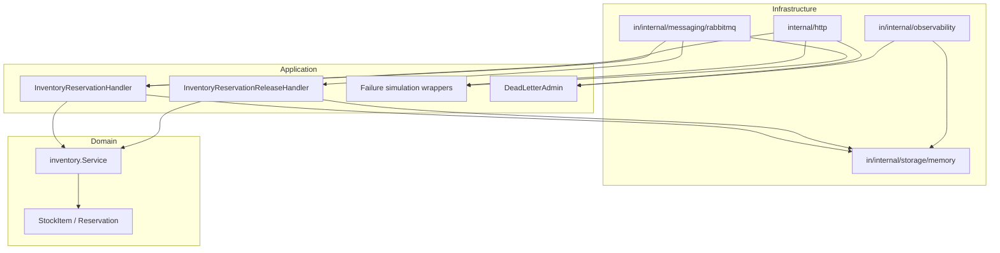
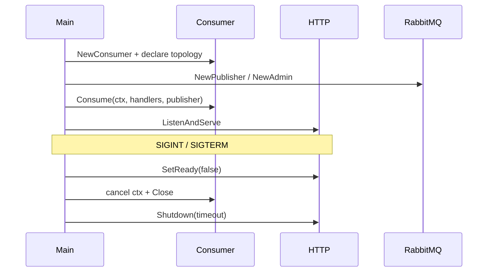
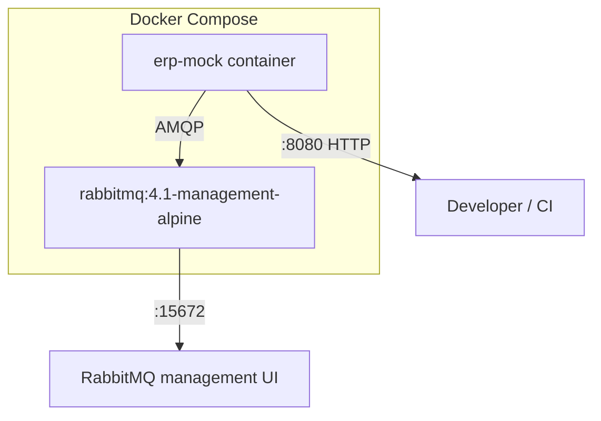

# Architecture

`stockflow-erp-mock` is a sandbox ERP/WMS inventory boundary for the Stockflow
marketplace case study. It simulates an external warehouse system that the
marketplace integrates with over RabbitMQ, while exposing a small HTTP API for
local inspection and demo tooling.

This is **not** a production ERP. No real warehouse or WMS is connected.

The service is deliberately small, but the design mirrors patterns found in production
event-driven integrations: versioned contracts, idempotent consumers, retry and
dead-letter routing, observability, and controlled failure injection for testing.

## StockFlow ecosystem

Part of the StockFlow ecosystem:

- [stockflow-market](https://github.com/Smiley-Alyx/stockflow-market) — marketplace backend case study
- [stockflow-erp-mock](https://github.com/Smiley-Alyx/stockflow-erp-mock) — external ERP / inventory integration mock (this repository)
- [stockflow-payment-mock](https://github.com/Smiley-Alyx/stockflow-payment-mock) — external payment provider mock
- [stockflow-delivery-mock](https://github.com/Smiley-Alyx/stockflow-delivery-mock) — external delivery provider mock

The marketplace is the orchestrator. External mocks are independent services with
their own HTTP APIs, persistence, and RabbitMQ topology. Integration is
contract-first: each boundary publishes AsyncAPI specs and JSON Schemas under
`contracts/`.

| Repository | RabbitMQ exchange | Integration role |
| --- | --- | --- |
| [stockflow-market](https://github.com/Smiley-Alyx/stockflow-market) | — (orchestrator) | Checkout, orders, publishes provider requests, consumes outcomes |
| [stockflow-erp-mock](https://github.com/Smiley-Alyx/stockflow-erp-mock) | `stockflow.inventory` | Inventory reservation and release |
| [stockflow-payment-mock](https://github.com/Smiley-Alyx/stockflow-payment-mock) | `stockflow.payment` | Payment authorization, capture, refund |
| [stockflow-delivery-mock](https://github.com/Smiley-Alyx/stockflow-delivery-mock) | `stockflow.delivery` | Shipment creation, cancellation, status events |

Cross-service correlation uses the same `correlation_id` on every message in a
checkout flow. Each outbound event sets `causation_id` to the incoming request
`message_id`, so the market can trace causality across ERP, payment, and delivery
boundaries.

## Problem context

A marketplace needs to reserve stock in an external ERP before confirming an order.
The real ERP is slow to provision, expensive to call in development, and hard to
fault-inject. This mock replaces the ERP boundary with:

- an **AsyncAPI contract** both sides can implement against;
- **RabbitMQ** as the integration transport;
- an **HTTP admin surface** for local inspection and chaos testing.

The mock trades persistence and multi-tenant isolation for fast feedback,
predictable sandbox behaviour, and a portfolio-grade integration story.

## System context

```text
                         ┌─────────────────────────────────────────┐
                         │           stockflow-market              │
                         │  checkout · orders · fulfillment        │
                         └───────┬─────────────┬─────────────┬───────┘
                                 │             │             │
                    inventory    │   payment   │   delivery  │
                    reservation  │   auth/cap  │   shipment  │
                                 │             │             │
         ┌───────────────────────▼──┐  ┌───────▼────────┐  ┌──▼────────────────────┐
         │   stockflow-erp-mock     │  │ stockflow-     │  │ stockflow-delivery-   │
         │   stockflow.inventory    │  │ payment-mock   │  │ mock                  │
         │   (this service)         │  │ stockflow.     │  │ stockflow.delivery    │
         │                          │  │ payment        │  │                       │
         └──────────────────────────┘  └────────────────┘  └───────────────────────┘
                                 RabbitMQ · AsyncAPI v1 · shared headers
```

| Integration | Role |
| --- | --- |
| RabbitMQ | Primary integration path for reservation and release commands |
| HTTP API | Stock inspection, reservation views, debug/demo controls |
| In-memory store | Simulated warehouse state, idempotency, reservations |

Contracts live in [`contracts/`](../contracts/). Runtime topology is declared by
the consumer on startup.

## Layered design

The codebase follows a pragmatic hexagonal layout: domain logic at the centre,
application use cases around it, infrastructure at the edge.



### Package responsibilities

| Package | Responsibility |
| --- | --- |
| `cmd/erp-mock` | Process wiring, graceful shutdown, goroutine lifecycle |
| `internal/domain/inventory` | Pure stock/reservation rules (`Reserve`, `Release`) |
| `internal/app` | Use cases: idempotency, reservation/release handlers, failure modes |
| `internal/messaging/rabbitmq` | AMQP consumer, publisher, topology declaration, admin |
| `internal/storage/memory` | In-memory repository and idempotency store |
| `internal/http` | REST admin API, health, readiness |
| `internal/observability` | Prometheus metrics |
| `contracts/` | AsyncAPI contract and JSON Schema payloads |

### Runtime composition

At startup the service creates three RabbitMQ clients:

1. **Consumer** — declares topology, consumes inbound queues, ack/nack/retry/DLQ.
2. **Publisher** — publishes outcome events with publisher confirms.
3. **Admin** — inspects DLQ depth and requeues bounded batches of dead letters.

The HTTP server runs concurrently with the consumer loop. Shutdown cancels the
consumer context, closes AMQP resources, then drains the HTTP server within
`ERP_SHUTDOWN_TIMEOUT`.



## Data and state model

Inventory state lives entirely in memory:

- **Stock items** — available and reserved quantities per SKU.
- **Reservations** — active or released records keyed by reservation ID.
- **Idempotency entries** — cached handler results keyed by `idempotency_key`.

Default seed stock:

| SKU | Available |
| --- | ---: |
| `sku-red-mug` | 120 |
| `sku-blue-notebook` | 80 |
| `sku-black-bag` | 40 |

Failure mode settings are also in-memory and reset on restart.

## Contract-first integration

The public integration surface is asynchronous and versioned:

- Contract: [`contracts/asyncapi.yaml`](../contracts/asyncapi.yaml)
- Payload schemas: [`contracts/messages/`](../contracts/messages/)

Routing keys follow the pattern `inventory.reservation.<event>.v1`. All messages share
a standard header envelope (`message_id`, `correlation_id`, `causation_id`,
`idempotency_key`, `occurred_at`, `schema_version`, `retry_count`).

HTTP endpoints are operational only — they are not part of the marketplace contract.

## Observability

Prometheus metrics are exposed at `GET /metrics`:

- message processing counters and histograms;
- reservation outcome counters (confirmed, rejected, released);
- idempotency hit counter;
- gauges for current stock, active reservations, and DLQ depth.

Structured logs use `slog` with JSON output. Each processed message logs correlation
and reservation identifiers for traceability across retries.

## Deployment



The production image is a multi-stage build producing a `scratch` image running as
UID `65532`. Only the compiled binary is copied into the final layer.

CI runs unit tests, `go vet`, `golangci-lint`, and `docker build` on every push
and pull request to `main`.

## Design trade-offs

### In-memory storage

| Benefit | Cost |
| --- | --- |
| Zero external database dependency | State lost on restart |
| Fast, deterministic tests | Not suitable for multi-instance deployment |
| Simple repository interface | No audit trail across process lifetimes |

**When to change:** introduce a persistent store if the mock must survive restarts,
support horizontal scaling, or retain idempotency keys for longer than one session.

### RabbitMQ retry via TTL dead-letter

| Benefit | Cost |
| --- | --- |
| No custom scheduler process | Fixed retry delay per queue |
| Broker-native redelivery | Retry timing depends on queue TTL, not exponential backoff |
| Clear separation of retry vs DLQ | Misconfigured TTL affects all messages on that queue |

**Alternative considered:** in-process retry with sleep. Rejected because it blocks
consumer prefetch slots and couples retry policy to process uptime.

### Separate publisher confirms channel

| Benefit | Cost |
| --- | --- |
| Outcome publication failures trigger retry/DLQ | Three AMQP connections per process |
| Confirms detect broker rejections | Slightly higher connection overhead |

**Alternative considered:** single shared channel. Rejected to keep consumer ack
semantics isolated from publisher confirm back-pressure.

### Failure simulation in-process

| Benefit | Cost |
| --- | --- |
| No external chaos tooling required | Settings are not durable |
| Deterministic, scriptable via HTTP | Only one active mode at a time |
| Exercises real retry/idempotency paths | Not representative of network partitions |

See [`failure-modes.md`](failure-modes.md) for operational detail.

### Idempotency at application layer

| Benefit | Cost |
| --- | --- |
| Safe redelivery after retry or duplicate publish | In-memory scope only |
| Conflicts detected when key reused with different payload | Marketplace must generate stable keys |
| Concurrent duplicate requests coalesce via in-flight tracking | No cross-service deduplication |

**Production note:** a real ERP would typically persist idempotency keys with TTL
aligned to business retention policy.

## Related docs

- [Integration flow](integration-flow.md) — message flows and RabbitMQ topology
- [Failure modes](failure-modes.md) — sandbox failure injection
- [Demo walkthrough](demo.md) — hands-on scenarios
- [Messaging contracts](../contracts/asyncapi.yaml) — AsyncAPI and JSON Schemas
- [stockflow-payment-mock](https://github.com/Smiley-Alyx/stockflow-payment-mock) — payment boundary
- [stockflow-delivery-mock](https://github.com/Smiley-Alyx/stockflow-delivery-mock) — delivery boundary
- [stockflow-market](https://github.com/Smiley-Alyx/stockflow-market) — marketplace orchestrator
