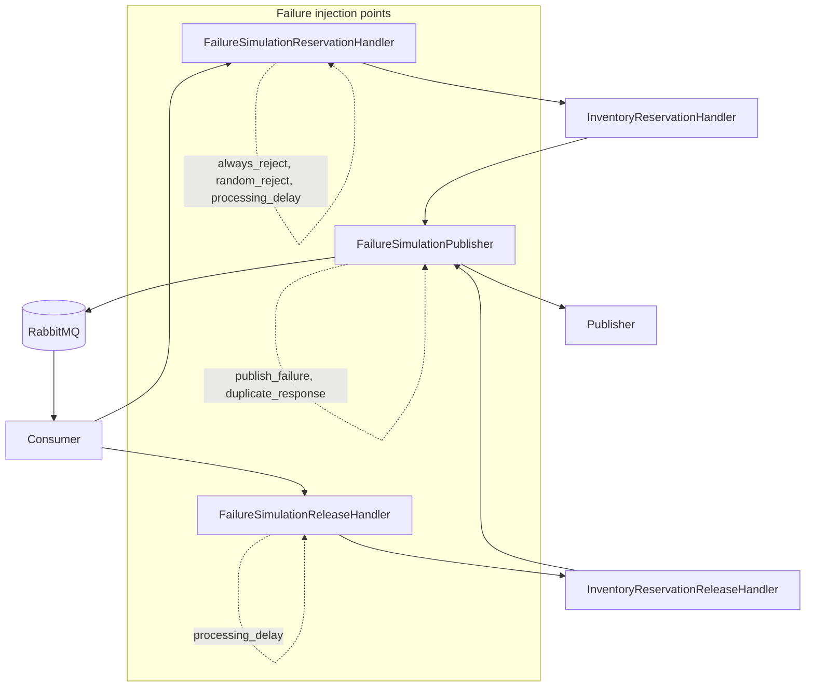
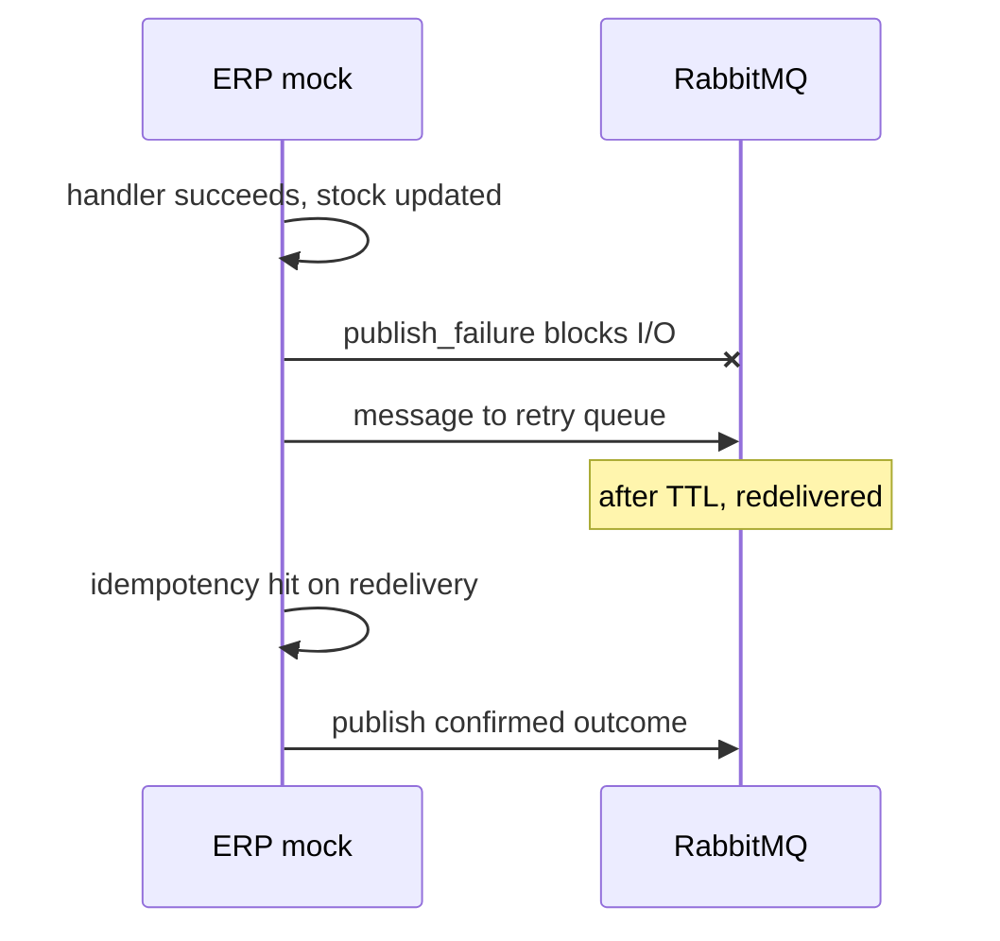
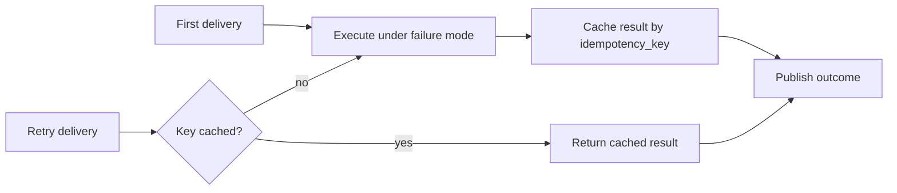

# Failure modes

The ERP mock includes a **sandbox failure simulation** layer for the
`stockflow-market` case study. Integrators can exercise retry, idempotency,
duplicate delivery, and DLQ paths without external chaos tooling.

Part of the StockFlow ecosystem:
[stockflow-market](https://github.com/Smiley-Alyx/stockflow-market),
[stockflow-erp-mock](https://github.com/Smiley-Alyx/stockflow-erp-mock),
[stockflow-payment-mock](https://github.com/Smiley-Alyx/stockflow-payment-mock),
[stockflow-delivery-mock](https://github.com/Smiley-Alyx/stockflow-delivery-mock).

Sibling mocks use the same patterns — debug failure modes, retry queues, DLQ,
and Prometheus metrics — so the market can exercise end-to-end degradation across
inventory, payment, and delivery boundaries. See
[`architecture.md`](architecture.md#stockflow-ecosystem) for how the services
interact.

Failure modes are configured at runtime through `POST /debug/failure-mode`.
Only **one mode is active at a time**. Settings live in memory and reset to
`normal` when the service restarts.

## Why failure simulation exists

Production ERP integrations fail in ways unit tests rarely cover:

- transient publish errors after successful processing;
- duplicate outcome delivery;
- slow responses that interact with consumer timeouts;
- business rejections that must remain idempotent on retry.

The mock injects these behaviours at well-defined points in the pipeline while
keeping the real RabbitMQ retry/DLQ machinery active.



## Quick reference

| Mode | Effect | Retry/DLQ | Idempotent |
| --- | --- | --- | --- |
| `normal` | No simulation | — | — |
| `always_reject` | Every reservation rejected with `FAILURE_MODE` | No | Yes |
| `random_reject` | Probabilistic reservation rejection | No | Yes |
| `processing_delay` | Delays reservation and release handling | No | Yes |
| `publish_failure` | Outcome publish fails before AMQP I/O | **Yes** | Yes |
| `duplicate_response` | Publishes each reservation outcome twice | No | Yes (inventory once) |

## Mode details

### `normal`

Default production-like behaviour. Use as baseline before and after chaos scenarios.

```bash
curl -X POST http://localhost:8080/debug/failure-mode \
  -H 'content-type: application/json' \
  --data '{"mode":"normal"}'
```

### `always_reject`

Every reservation request returns `inventory.reservation.rejected.v1` with reason
`FAILURE_MODE`. Stock is **not** modified.

**Use case:** verify the marketplace handles ERP-side rejection without treating it
as a transport error.

```bash
curl -X POST http://localhost:8080/debug/failure-mode \
  -H 'content-type: application/json' \
  --data '{"mode":"always_reject"}'
```

### `random_reject`

Rejects reservations with probability `random_reject_probability` (0, 1].

**Use case:** soak tests and statistical coverage of rejection handling.

```bash
curl -X POST http://localhost:8080/debug/failure-mode \
  -H 'content-type: application/json' \
  --data '{"mode":"random_reject","random_reject_probability":0.25}'
```

### `processing_delay`

Delays handler execution by `processing_delay_ms`. Observes context cancellation,
so graceful shutdown is not blocked by an active timer.

**Use case:** test consumer timeout behaviour, concurrent reservation ordering,
and readiness probe interaction under slow processing.

```bash
curl -X POST http://localhost:8080/debug/failure-mode \
  -H 'content-type: application/json' \
  --data '{"mode":"processing_delay","processing_delay_ms":500}'
```

### `publish_failure`

Fails `PublishReservationResult` before any RabbitMQ I/O. The consumer treats this
as a transient publisher error and routes through **retry → DLQ** like a real
broker failure.



**Use case:** validate that duplicate processing does not double-reserve stock
when the first attempt updated inventory but failed to publish.

```bash
curl -X POST http://localhost:8080/debug/failure-mode \
  -H 'content-type: application/json' \
  --data '{"mode":"publish_failure"}'
```

### `duplicate_response`

Publishes each reservation outcome **twice** while applying the inventory operation
**once**. Release outcomes are not duplicated.

**Use case:** verify the marketplace deduplicates outcome events or treats repeated
`idempotency_key` on outcomes as safe.

```bash
curl -X POST http://localhost:8080/debug/failure-mode \
  -H 'content-type: application/json' \
  --data '{"mode":"duplicate_response"}'
```

## Idempotency interaction

Reservation rejection modes wrap the handler with a dedicated idempotency store.
The first outcome for a given `idempotency_key` is cached — subsequent redeliveries
return the same logical result even if the active failure mode has changed.



This mirrors production expectations: **processing is idempotent; mode changes do
not retroactively alter prior decisions for the same key**.

## Suggested test matrix

| Scenario | Mode | Expected marketplace behaviour |
| --- | --- | --- |
| Baseline order | `normal` | Receive confirmed, proceed to payment |
| ERP decline | `always_reject` | Cancel order, do not retry indefinitely |
| Flaky ERP | `random_reject` | Handle mixed confirm/reject, monitor rate |
| Slow ERP | `processing_delay` | Do not assume synchronous response |
| Lost outcome | `publish_failure` | Wait for retry outcome, no double charge |
| Duplicate outcome | `duplicate_response` | Dedupe by outcome idempotency key |

## Operational notes

- Failure modes affect **reservation** simulation most heavily; release only
  receives `processing_delay`.
- `publish_failure` and `duplicate_response` apply to the publisher wrapper, not
  retry/DLQ forwarding — retry and dead-letter publication always proceed.
- Combine with `GET /metrics` to observe `stockflow_erp_mock_idempotency_hits_total`
  and `stockflow_erp_mock_dlq_depth` during chaos runs.
- After exhausting retries, requeue DLQ messages via `POST /debug/dlq/requeue`.

## Trade-offs

| Choice | Benefit | Cost |
| --- | --- | --- |
| HTTP-controlled modes | Scriptable, no redeploy | Not durable, no auth in sandbox |
| Single active mode | Predictable behaviour | Cannot combine delay + publish failure |
| In-memory idempotency for rejections | Stable outcomes under mode changes | Lost on restart |
| Publisher-level injection | Exercises real retry topology | Does not simulate network partition |
| No release duplicate mode | Simpler publisher wrapper | Release dedup not testable here |

For a production ERP, failure injection would live in a staging environment with
audited toggles and authenticated operators — the mock intentionally keeps the
surface minimal for local development.

## Related docs

- [Integration flow](integration-flow.md) — retry and DLQ mechanics
- [Demo walkthrough](demo.md) — hands-on failure mode scenarios
- [Architecture](architecture.md) — where failure wrappers sit in the stack
- [Payment failure modes](https://github.com/Smiley-Alyx/stockflow-payment-mock/blob/main/docs/failure-modes.md) — sibling payment boundary
- [Delivery failure modes](https://github.com/Smiley-Alyx/stockflow-delivery-mock/blob/main/docs/failure-modes.md) — sibling delivery boundary
