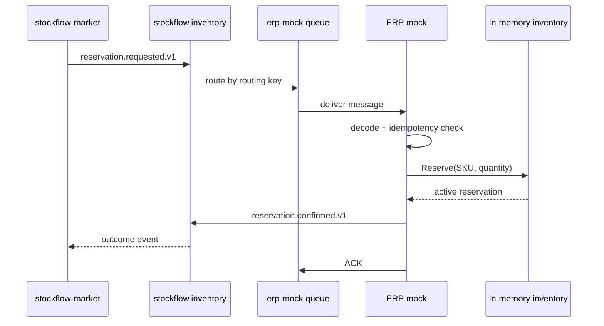
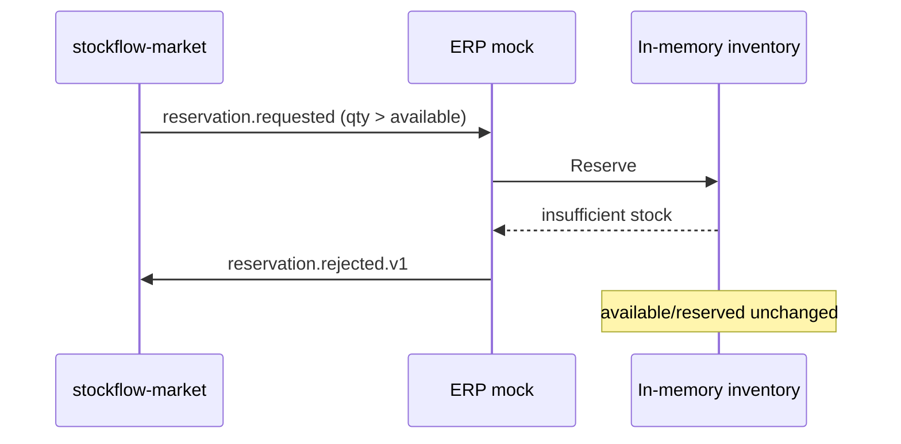
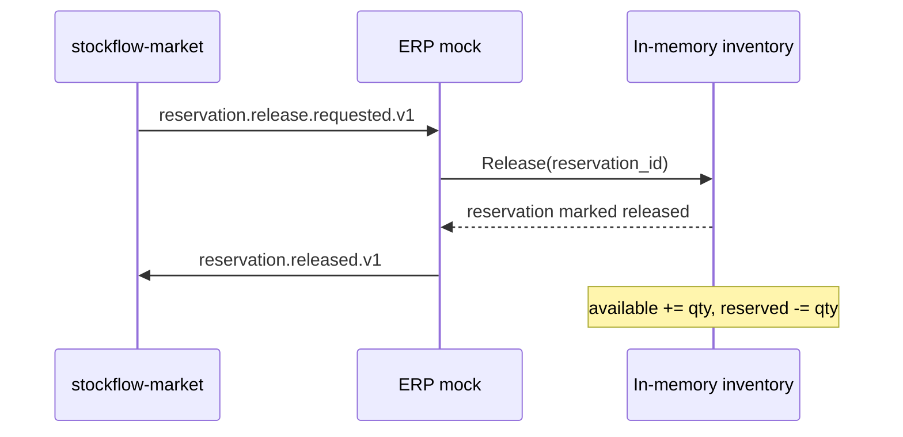
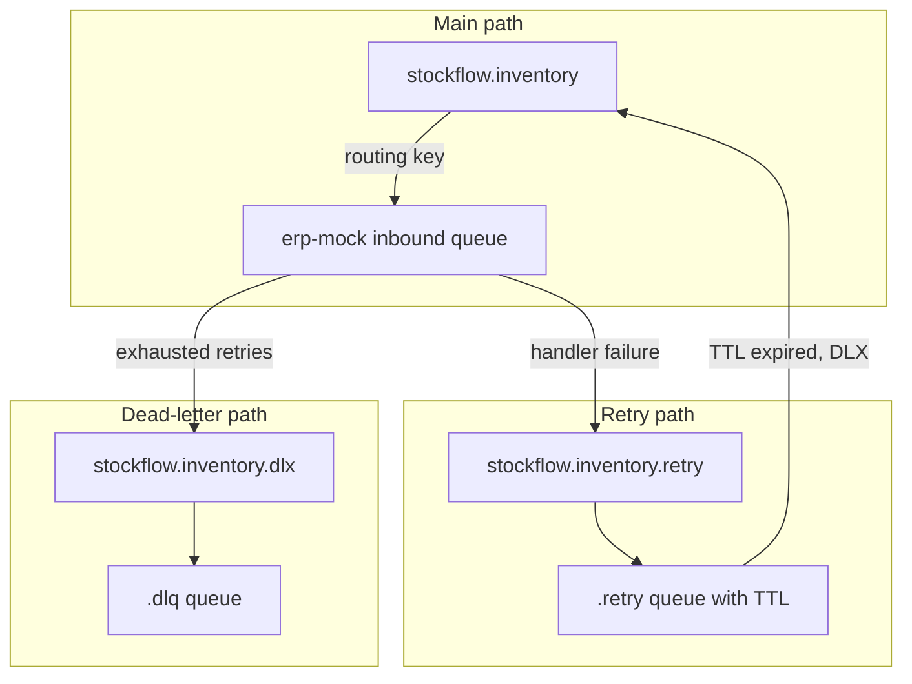
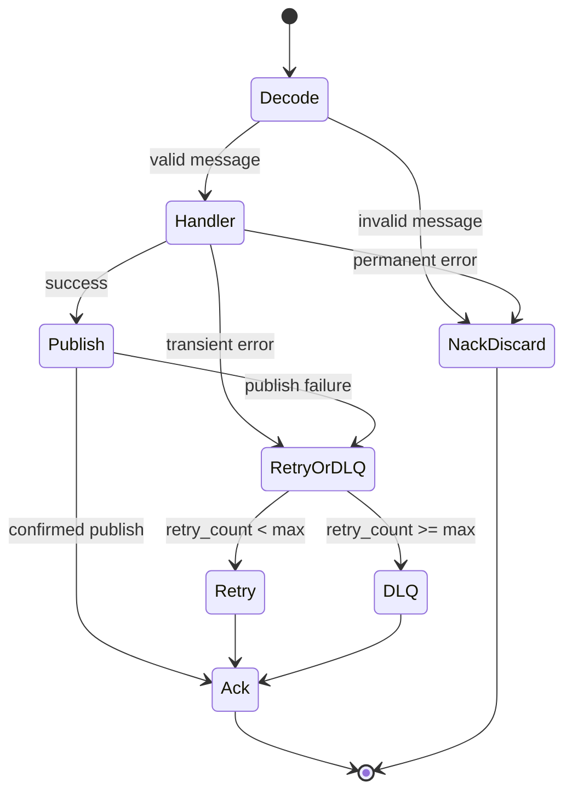
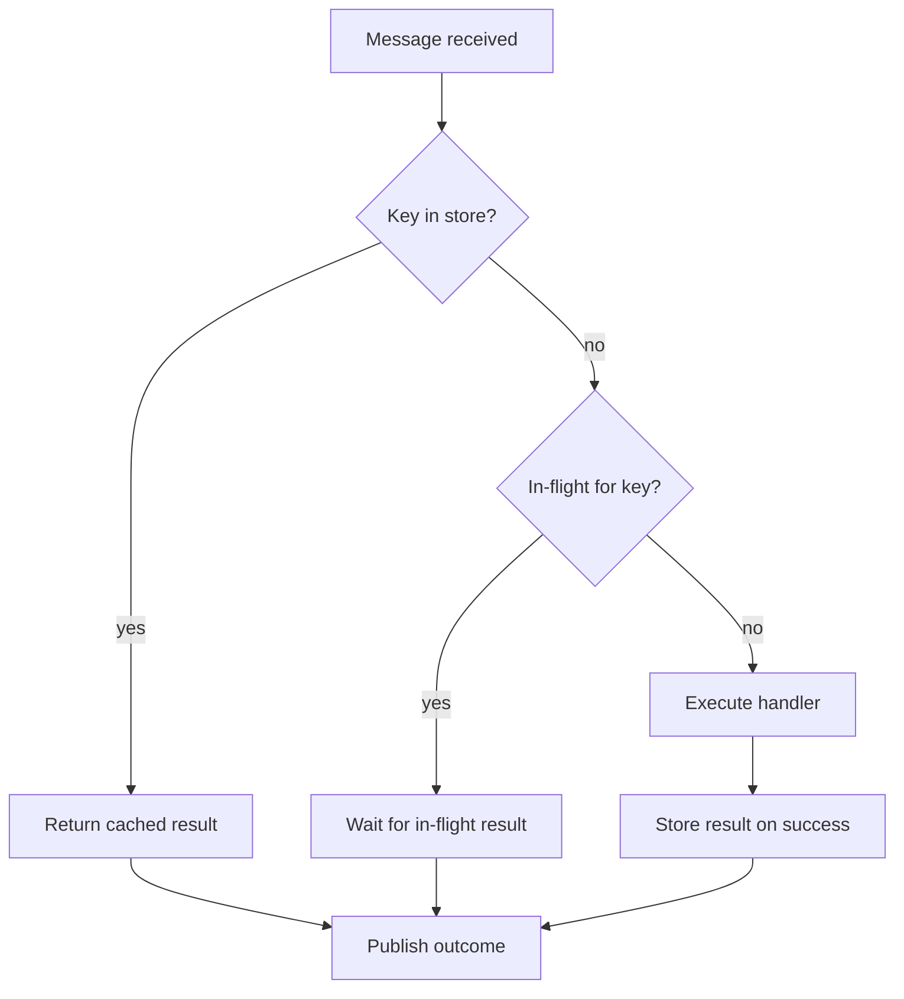
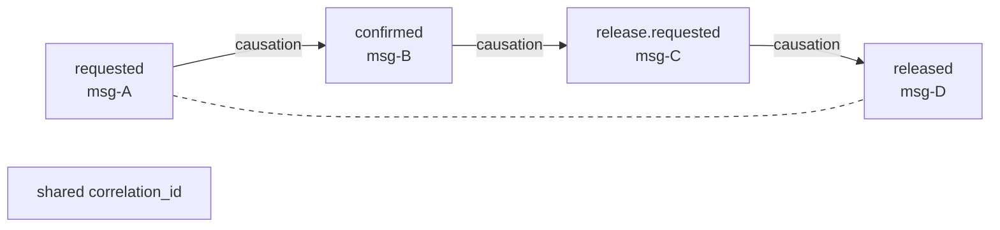

# Integration flow

Inventory reservation and release over RabbitMQ for the `stockflow-market`
case study. This repository covers the **inventory** boundary only; payment and
delivery flows live in sibling mocks (see
[`architecture.md`](architecture.md#stockflow-ecosystem)).

Part of the StockFlow ecosystem:
[stockflow-market](https://github.com/Smiley-Alyx/stockflow-market),
[stockflow-erp-mock](https://github.com/Smiley-Alyx/stockflow-erp-mock),
[stockflow-payment-mock](https://github.com/Smiley-Alyx/stockflow-payment-mock),
[stockflow-delivery-mock](https://github.com/Smiley-Alyx/stockflow-delivery-mock).

The canonical contract is [`contracts/asyncapi.yaml`](../contracts/asyncapi.yaml).

## Message catalogue

| Direction | Routing key | Purpose |
| --- | --- | --- |
| Inbound | `inventory.reservation.requested.v1` | Reserve stock for an order line |
| Inbound | `inventory.reservation.release.requested.v1` | Release a previously confirmed reservation |
| Outbound | `inventory.reservation.confirmed.v1` | Stock successfully reserved |
| Outbound | `inventory.reservation.rejected.v1` | Reservation declined (business reason) |
| Outbound | `inventory.reservation.released.v1` | Reservation released, stock returned |
| Outbound | `inventory.reservation.release_failed.v1` | Release could not be completed |

All messages use exchange `stockflow.inventory` (topic, durable).

## Standard message envelope

Every message carries the same header set:

| Header | Purpose |
| --- | --- |
| `message_id` | Unique ID of this message (UUID) |
| `correlation_id` | Shared across the entire reservation lifecycle |
| `causation_id` | Non-empty ID of the message that caused this one; may use a provider-specific format |
| `idempotency_key` | Stable deduplication key for processing |
| `occurred_at` | UTC timestamp when the message was created |
| `schema_version` | Payload schema version (currently `1`) |
| `retry_count` | Number of previous processing attempts |

Outcome messages derive idempotency keys from the inbound key:

```
{inbound_idempotency_key}:{decision}
```

Example: `reservation:res-10001:create` → `reservation:res-10001:create:confirmed`.

## Happy path: reservation



### Inbound payload

```json
{
  "reservation_id": "res-10001",
  "order_id": "ord-10001",
  "sku": "sku-red-mug",
  "quantity": 2
}
```

### Outbound payload (confirmed)

```json
{
  "reservation_id": "res-10001",
  "order_id": "ord-10001",
  "sku": "sku-red-mug",
  "quantity": 2,
  "reserved_at": "2026-05-31T09:00:01Z"
}
```

### Business rejection

When stock is insufficient or the SKU is unknown, the handler returns a **rejected**
outcome rather than an error. Stock is not modified. Reason code:
`INSUFFICIENT_STOCK`.



Permanent handler errors (invalid arguments, idempotency conflict, duplicate
reservation ID) result in **NACK without requeue** — the message is discarded
after logging.

## Happy path: release



Release failures are modeled as outcome events, not transport errors:

| Reason | When |
| --- | --- |
| `RESERVATION_NOT_FOUND` | Unknown reservation ID |
| `RESERVATION_NOT_ACTIVE` | Reservation already released |

## RabbitMQ topology

Each inbound flow (reservation request, release request) gets an identical reliability
pattern:



### Queue naming

| Queue | Routing key |
| --- | --- |
| `stockflow.erp-mock.inventory.reservation.requested.v1` | `inventory.reservation.requested.v1` |
| `...requested.v1.retry` | same |
| `...requested.v1.dlq` | same |
| `stockflow.erp-mock.inventory.reservation.release.requested.v1` | `inventory.reservation.release.requested.v1` |
| `...release.requested.v1.retry` | same |
| `...release.requested.v1.dlq` | same |

The ERP mock **declares** this topology on consumer startup. Outcome routing keys
are published to `stockflow.inventory`; consuming outcomes is the marketplace's
responsibility.

## Processing lifecycle



| Failure class | Examples | Action |
| --- | --- | --- |
| Invalid message | Missing header, bad JSON, schema mismatch | NACK, no requeue |
| Permanent handler error | Idempotency conflict, duplicate reservation | NACK, no requeue |
| Transient error | Publisher confirm timeout, unexpected DB error | Retry queue or DLQ |
| Business outcome | Insufficient stock, reservation not found | Publish outcome, ACK |

Default retry policy (`ERP_RABBITMQ_MAX_RETRY_COUNT=3`, `ERP_RABBITMQ_RETRY_DELAY=2s`):

1. First failure → `retry_count=1`, message enters retry queue.
2. After TTL → dead-letter back to main exchange → inbound queue.
3. After max retries → message routed to DLQ, original delivery ACKed.

If retry publication itself fails, the consumer **NACKs with requeue** as a last
resort so the broker can redeliver in-process.

## Idempotency

Idempotency is enforced in the application layer before inventory mutation:



Properties:

- **At-least-once delivery** from RabbitMQ is safe for inventory side-effects.
- **Duplicate concurrent requests** with the same key coalesce on one in-flight call.
- **Key conflict** — same key, different payload → permanent error, no requeue.
- **Failure mode rejections** are idempotent: the rejection outcome is cached under
  the inbound key.

Separate idempotency stores exist for reservation and release flows.

## Correlation and causation

`correlation_id` ties all messages in one business flow (create → confirm → release).
`causation_id` on outcome messages points to the inbound `message_id` that triggered
them, enabling causal tracing without a distributed tracing backend.

Example chain:



## Dead-letter administration

Messages in DLQ can be inspected via RabbitMQ management UI or requeued through
the HTTP admin API:

```bash
curl -X POST http://localhost:8080/debug/dlq/requeue \
  -H 'content-type: application/json' \
  --data '{"queue":"reservation_requests","limit":10}'
```

Requeue republishes to `stockflow.inventory` with `retry_count` reset to `0`.
The limit is capped at 100 messages per call.

DLQ depth is exported as `stockflow_erp_mock_dlq_depth{queue="..."}`.

## Automated verification

Unit tests cover decode logic, ack/nack decisions, and handler behaviour with stub
deliveries. Integration tests (`make test-integration`) exercise the full AMQP path
against a real RabbitMQ instance via Testcontainers:

- reservation confirmed / rejected;
- idempotent redelivery;
- reserve → release lifecycle;
- release not found.

## Trade-offs in the integration design

| Decision | Rationale | Limitation |
| --- | --- | --- |
| Topic exchange with versioned routing keys | Explicit contract evolution (`v1`, `v2`) | Consumers must bind to exact keys |
| Application-level idempotency | Works regardless of broker deduplication support | Not durable across restarts |
| Outcome events for business failures | Marketplace gets structured rejection reasons | More message types to handle |
| Publisher confirms on outcomes | Detect broker-side publish failures | Adds latency vs fire-and-forget |
| Fixed TTL retry | Simple broker-native mechanism | No exponential backoff |
| Consumer declares topology | Self-contained sandbox setup | Competing consumers must agree on names |

## Related docs

- [Architecture](architecture.md) — system structure and component map
- [Failure modes](failure-modes.md) — injected failure scenarios
- [Demo walkthrough](demo.md) — step-by-step local demonstration
- [Payment flow](https://github.com/Smiley-Alyx/stockflow-payment-mock/blob/main/docs/payment-flow.md) — sibling payment boundary
- [Delivery flow](https://github.com/Smiley-Alyx/stockflow-delivery-mock/blob/main/docs/delivery-flow.md) — sibling delivery boundary
